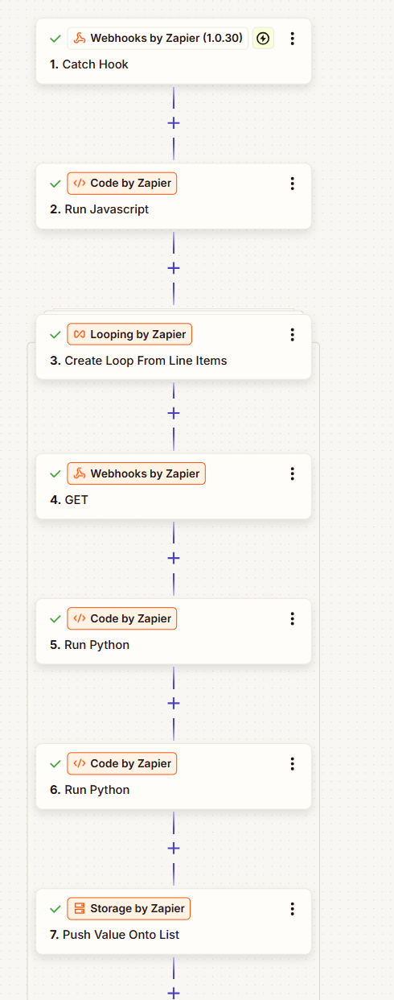
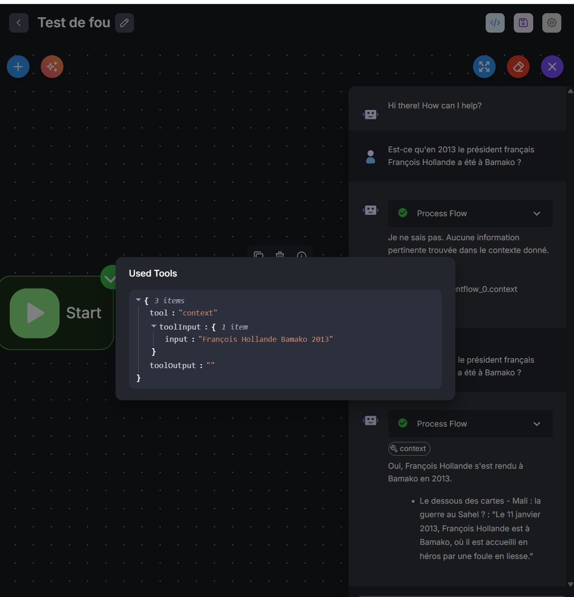

# Tests réalisés sur Zapier (échec)

Traitement qui prenait le fichier .json et fetchait chacune des urls des sous-titres pour les process
Nettoyage des sous-titres pour ingestion (suppression de tous les caractères inutiles)
Volonté de créer un webhook ou une API pour avoir accès aux données traitées

Problèmes avec le fait de boucler sur un tableau de données, problème lié au composant de looping ou lié au stockage des données durant le looping (les données n'étaient pas sauvegardées temporairement)
Différents essais durant plusieurs heures puis abandon et création d'un notebook jupyter

## Tests python réalisées en local 

Essais d'utiliser un notebook en local mais versions de python et packages pas à jour donc abandon

## Création d'un conteneur docker pour lancer le notebook 

Environnement docker pour lancer le notebook
Nettoyage des données identiques à ce qui se serait passé côté Zapier
création d'un fichier cleaned_subtitles_dataset.json et .csv

Dans un soucis de rapidité nous allons juste utiliser le fichier .json généré pour pouvoir essayer de le faire ingérer à une bdd vectorielle
sans passer par une api ou un webhook

## Utilisation de Langflow

Tests avec Langflow en version hébergée par Datastax non concluantes (pb APi keys en ligne, impossibilité pour moi d'héberger mes services sur un serveur ou autre parce que je n'en ai pas sous la main), puis problèmes en local. (Après avoir fait des tests sur une autre plateforme, il n'y avait peut-être pas de soucis avec la version cloud puisque j'ai découvert par la suite que j'avais un problème de clé d'API pour accéder à Mistral AI)
En local gros problèmes entre les composants anciens et nouveaux, nouvelles erreurs à tous les essais que ça soit pour utiliser un JSON au format classique ou sous forme de liste ou pour essayer d'accéder à une bdd vectorielle.
Même en local impossible.
L'application sur PC Langflow rame beaucoup et buggue ++++ sur Windows, de nombreuses installations ont été nécessaires et je pense que ça fait crasher mon pc avec Docker en route en parallèle

L'utilisation de Langflow sous forme de code beaucoup + appropriée

Installation de Weaviate sur mon conteneur docker de développement python pour le moment
Les bdd vectorielles ne sont pas installées par défaut dans langflow, il faut utiliser une image docker full

## Utilisation de Flowise

au final essai de flowise mais certains templates sont basés sur des anciennes versions logicielles donc j'avais des erreurs sans trop savoir pourquoi.
aucune info sur le fait que ça soit mal maintenu

la clé api mistral données ne fonctionnait pas, mais étant donné que la chaine flowiseai n'indiquait rien (obsolète) je pensais que le problème venait de ma bdd : Astra

J'ai fait moi-même le chunking des données dans mon notebook par la suite pour les ingérer dans ma bdd vectorielle Astra parce que je ne savais pas si c'est cette partie ou non qui faisait bugguer mes flows (sous langflow ou sous flowise)
J'ai ensuite "ajouté à la main" les données depuis un fichier .json contenant toutes les données chunkées dans Astra. Possibilité d'utiliser des embeddings Nvidia avec Astra au lieu de l'embedding de Mistral que j'ai utilisé dans mes flows.

après avoir essayé un template récent, plus aucun problème et après quelques heures de tests, on peut enfin voir un contexte apparaitre
la documentation de flowise est très légère mais on arrive à obtenir un résultat !

## installation de flowise en local

fait facilement

## installation de wikipedia mcp en local

problème de binding de port sur 127.0.0.1 à l'intérieur du container, ce qui empêchait son accès depuis mon navigateur et depuis flowise

Nécessité de créer un wrapper parce que le mcp de wikipédia utilise du sse pour l'envoi des données et ça n'est pas géré nativement par flowise