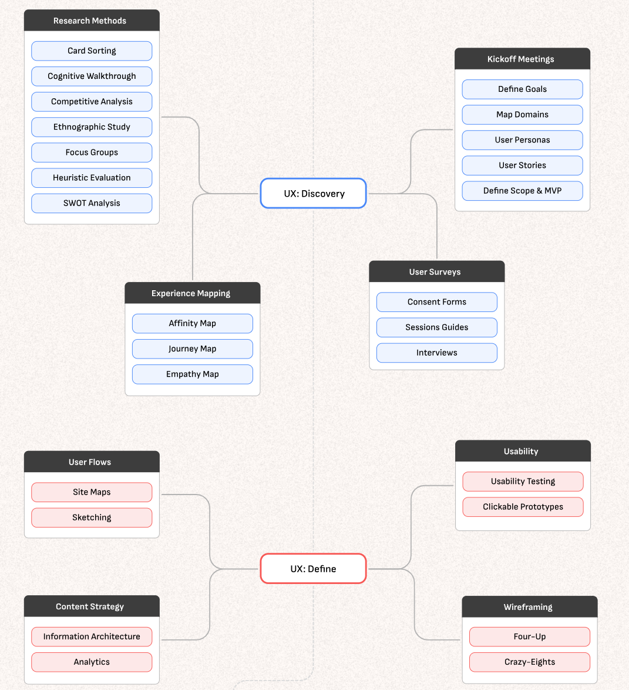

#Etude sur ARTE intitulée Le dessous des cartes :

Fonctionnalité sur arte.tv permettant de « discuter avec les vidéos »

Ci-joint un fichier JSON contenant les métadonnées des 10 derniers épisodes, avec notamment les vidéos et les sous-titres.

### Redéfinition du besoin ?
Pourquoi souhaite-t-on discuter avec les vidéos du dessous des cartes ?
But éducationnel ? 
Neutralité scientifique ? déontologie ?
Discuter par écrit ou par oral ?
Financement pour le développement des fonctionnalités mais pour le maintien du service une fois la fin des subventions ? 

### Les 5P

On souhaite discuter avec un chatbot en dessous des vidéos du dessous des cartes

Pourquoi ?
- Pour mieux comprendre des aspects de la vidéo qu'on a mal ou pas bien compris 
*Pourquoi veut-on mieux comprendre ces sujets ?*
- Parce que certains termes sont difficiles à comprendre (géopolitique) et parce que le format des vidéos est court 
*Pourquoi a-t-on besoin d’explications complémentaires ?*
- Parce que chaque viewer n’a pas le même niveau de culture géopolitique et a donc besoin d'un accompagnement personnalisé
*Pourquoi est-ce important d’avoir un accompagnement personnalisé ?*
- Parce qu’un contenu plus accessible et interactif renforce l’engagement, l’apprentissage et l’envie de revenir sur Arte.tv
*Pourquoi veut-on renforcer l’engagement et l’apprentissage autour de Le Dessous des cartes ?*
- Parce que cela permettrait à Arte de remplir pleinement sa mission éducative tout en fidélisant un public curieux qui cherche à comprendre le monde de manière critique et nuancée.

**On veut discuter avec un chatbot sous les vidéos du Dessous des cartes pour rendre le contenu plus compréhensible, accessible et engageant, afin de renforcer l’impact éducatif d’ARTE et fidéliser un public curieux.**

### Hyper importance de l'UX & des viewers et des pôles métiers

- Création de personas, interviews, user flows

- https://roadmap.uxuiopen.com/

### Nécessités 

- scalabilité
- multilingue (7 langues européennes)
- frugalité (1 traitement par jour pour ingérer les données)
- respect de l'AI Act, du RGPD, de l'EAA
- utiliser principalement des technologies open-source
- réutilisabilité du projet par d'autres médias ?

### IA utilisables
- LLM/NLP + reinforcement learning 
- logical agents/règles (Pour intégrer un raisonnement pédagogique structuré ex : "Si l’utilisateur ne connaît pas ce terme, alors expliquer avec un exemple simple")

### Plateformes Arte.tv
- mobile
- app télé ?
- ordinateur ?
- combien de viewers de l'émission par jour ? (2 millions d'utilisateurs sur Arte.tv par jour potentiellement)
- présence sur les RS ? répondre aux questions des users ? aider les CM ?

### Emission le dessous des cartes 

But : éducation populaire sur la géopolitique en un temps limité à destination de XX public
Une émission publiée tous les XX jours

### Etude du fichier JSON et des datas

temps moyen des vidéos proposées dans les fichiers JSON
comment exploiter un fichier .vtt ? 

#### sous-titres
#### vidéo
#### son
#### images 

### Recherche concurrence

FireTV & YouTube Ask
Regarder ce qui a été fait côté data for good

https://support.google.com/youtube/answer/14110396?hl=en
https://www.aboutamazon.com/news/devices/how-amazon-developers-built-fire-tv-ai-search

### Recherche techniques actuelles pour répondre au besoin

Comme nous en avons discuté, voici également un serveur MCP pertinent si vous souhaitez tester :
https://github.com/Rudra-ravi/wikipedia-mcp

agents ??? rechercher des infos cools ?
LLMs avec capacité d'orchestration ou 

https://slite.com/learn/llm-knowledge-base 

LLMs entre 10 et 40% d'erreurs dans les réponses
quelles apis interroger pour être sûrs d'obtenir des réponses pertinentes ?

datamesh ???

rust avancées ? 
quantique avancées ? 

llms qui citent les sources ? 

### Pour aller plus loin

- traduire sous-titres dans les 7 langues nécessaires
- ingérer les données 
OU
- ingérer les données
- puis traduire dans une des 7 langues ? 

- RAG ?
- MCP 
- enregistrement des réponses
- enregistrement de feedbacks (pouce en bas si réponse pas ok et possibilité de commenter)
- surveillance des réponses (taux d'erreur)

- MLOPS/Dataops ?
